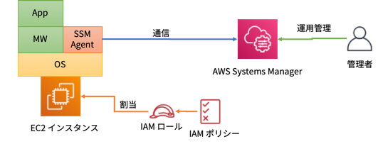

# EC2 インスタンスを起動して、AWS Systems Manager のセッションマネージャーからログインして操作する

このハンズオンでは、EC2 インスタンスを起動して **AWS Systems Manager (SSM)** の **セッションマネージャ** 機能を利用してEC2 インスタンスにログインして操作するまでを実施します。

## 作成するアーキテクチャ



EC2 インスタンスを起動します。今回は **Amazon Linux 2 AMI** を利用します。**セッションマネージャ** を利用するには、OS 上に **SSM Agent** をインストールする必要がありますが、Amazon Linux 2 AMI には SSM Agent はプリインストール済みです。  
SSM Agent は、**AWS Systems Manager** と連携して必要な処理をOS 上で実施しますが、その際にSSM Agent はSystems Manager へのアクセス権限が必要となります。そこで、SSM にアクセス可能な権限を持つ **IAM ロール** を作成し、EC2 インスタンスに割り当てます。  
この状態で、運用管理者はSystems Manager により、対象EC2 インスタンスをリモートで運用管理できるようになります。


## AWS 料金
- 12ヶ月無料利用枠内で実施できます。

## 前提条件
- マネジメントコンソールにログインできること
- VPC および EC2 サービスへのアクセス権限があること
- EC2 に関する知識はある程度あること

## 用語解説
このラボで理解が必要な用語を解説します。もしすでに知っている場合は読み飛ばしてください。

- AWS Systems Manager
  - AWS リソースを運用する上で便利な様々な機能を提供しているサービスです。主に起動中のEC2 インスタンスをリモートで自動運用する場合に便利です。　 
  例えば、あらかじめ用意したスクリプトをリモート実行する **ランコマンド** 機能や、指定されたポリシーに基づきEC2 インスタンス上のOS に自動的にパッチを適用する **パッチマネージャ**、決められた時間に指定した運用操作を実行する **メンテナンスウィンドウ** や、次に説明する **セッションマネージャ** などがあります。
- セッションマネージャ
  -  Systems Manager の機能の一つで、マネジメントコンソール上から対象EC2 インスタンスにリモートでログインしブラウザに表示されるターミナルからOS のコマンドを実行できる機能です。  
  セッションマネージャのメリットは、対象EC2 インスタンスにインバウンドのssh (22番ポート) のアクセスが不要なため、セキュリティグループで22番ポートの穴を開ける必要が無い点です。これにより不正にアクセスされてしまうリスクが低減します。またIAM ポリシーによりアクセスコントロールできるため、特定EC2 インスタンス内のOS へのアクセス制御をIAM ベースで実施することができます。(IAM ポリシーにSSM セッションマネージャの利用を指定すれば良い)  
  従来は、OS へのログインのためのキーペアの管理を適切に実施する必要がありましたが、セッションマネージャを利用すればその問題も発生しません。
- IAM ロール
  - 各種AWS リソースへのアクセス権限を付与するためのサービスです。このラボではEC2 インスタンスにIAM ロールを割り当てることで、EC2 インスタンスに対してSSM へのアクセス権限を付与します。


## 手順概要
- Task1: (Option) VPC を作成する
- Task2: EC2 にアタッチするIAM ロールを作成する
- Task3: EC2 インスタンスを起動する
- Taks4: セッションマネージャ経由でEC2 インスタンスにログインする
- Task5: セッションマネージャ経由でWebサーバを構築する

##  Task1: (Option) VPC を作成する

デフォルトVPC やすでに構成済みのVPC を利用する場合はこの作業は不要です。VPC を一から作成する場合は、次の手順を参考にVPC を作成しましょう。

- [パブリックサブネットを一つ持つVPC を作成する](../SinglePublicVPC/create-vpc-with-single-public-subnet.md)

##  Task2: EC2 にアタッチするIAM ロールを作成する

1. **マネジメントコンソール** にログインします。
   - https://console.aws.amazon.com

2. **サービス** から **IAM** を選択します。
3. 画面左のナビゲーションペインにて、**ロール** をクリックします。
4. **ロールの作成** ボタンをクリックします。
5. **ロールの作成** 画面の **信頼されたエンティティの種類を選択** にて **AWS サービス** を選択します。
6. そのすぐ下の **このロールを使用するサービスを選択** にて、**EC2** を選択します。
7. **次のステップ: アクセス権限** ボタンをクリックします。
8. **Attach アクセス権限ポリシー** にて、`AmazonEC2RoleforSSM` にチェックを入れます。検索 フィールドに上記ポリシー名を入れるとすぐに見つかります。
9. **次のステップ: タグ** ボタンをクリックします。
10. **タグの追加 (オプション)** 画面は何も入力せずに **次のステップ: 確認** ボタンをクリックします。
11. **確認** 画面にて以下の内容を入力します。
    - ロール名: `EC2SSMRole`
12. **ロールの作成** ボタンをクリックします。
13. 一覧上に **EC2SSMRole** が表示されていることを確認します。

##  Task3: Webサーバとして構成したEC2 インスタンスを起動する

1. リージョンを **東京** リージョンに変更します。
   
2. **サービス** から **EC2** を選択します。
3. ナビゲーションペインにて、**インスタンス** をクリックします。
4. **インスタンスの作成** ボタンをクリックします。
5. **手順 1: Amazon マシンイメージ (AMI)** 画面にて、**Amazon Linux 2 AMI (HVM), SSD Volume Type** の **選択** ボタンをクリックします。
6. **手順 2: インスタンスタイプの選択** 画面にて、**t2.micro** にチェックし(デフォルトでチェックされています)、**次の手順: インスタンスの詳細の設定** ボタンをクリックします。
7. **手順 3: インスタンスの詳細の設定** 画面にて、以下の内容を設定します。ここに記載していないフィールドはデフォルトのままとしておきます。
   - ネットワーク: `LabVPC` (もしくは デフォルト or ご自身のVPC)
   - サブネット: `PublicSubnet` (もしくは、デフォルトサブネット or ご自身のサブネット)
   - 自動割り当てパブリック IP: `有効` を選択
   - IAM ロール: `EC2SSMRole` を選択
8. **次の手順: ストレージの追加** ボタンをクリックします。
9.  **手順 4: ストレージの追加** 画面では、何も変更せずに **次の手順: タグの追加** ボタンをクリックします。
10. **手順 5: タグの追加** 画面で、**タグの追加** ボタンをクリックします。
11. 以下の内容を入力します。
    - キー: `Name`
    - 値: `LabWebServer`
12. **次の手順: セキュリティグループの設定** ボタンをクリックします。
13. **手順 6: セキュリティグループの設定** 画面にて、**既存のセキュリティグループを選択する** にチェックし、[パブリックサブネットを一つ持つVPC を作成する](../SinglePublicVPC/create-vpc-with-single-public-subnet.md) の手順で作成した、**LabWebSG** にチェックを入れます。(もしくは、80 番ポートを全てのIP アドレスからアクセス可能なセキュリティグループを選択 もしくは作成してください。SSH 22番ポートの許可は不要です。)
14. **確認と作成**　ボタンをクリックします。
15. **警告** ダイアログが表示され、ポート 22 が開いていない警告が出ますが、今回はSSM 経由でアクセスしますので、無視できます。**次へ** ボタンをクリックします。
16. **手順 7: インスタンス作成の確認** で **起動** ボタンをクリックします。
17. **既存のキーペアを選択するか、新しいキーペアを作成します** ダイアログにて **既存のキーペアの選択** を **キーペアなしで続行** に変更します。
18. **このAMI に組み込まれたパスワードがわからないと…略…** にチェックを入れて、**インスタンスの作成** ボタンをクリックします。
19. **作成ステータス** 画面で **インスタンスの表示** ボタンをクリックします。
20. インスタンス一覧にて、**LabWebServer** インスタンスが表示されていることを確認します。**インスタンスの状態** が **running** になるまで待ちましょう。
21. **LabWebServer** インスタンスにチェックを入れて、一覧下側に表示される **パブリックIP** をメモします。
22. ブラウザの新規タブを開いて、メモしたパブリックIP をアドレス蘭に入力してブラウザからアクセスしてみましょう。現在はまだWeb サーバとして構築していないので、エラーになります。

##  Taks4: セッションマネージャ経由でEC2 インスタンスにログインする

1. **サービス** から **Systems Manager** を選択します。

2. ナビゲーションペインにて、**セッションマネージャ** をクリックします。
3. **セッションの開始** ボタンをクリックします。
4. **セッションを開始する** 画面にてインスタンス名 **LabWebServer** を選択して、**セッションの開始** ボタンをクリックします。  
***Note***: 一覧に何も表示されていない場合は、**LabWebServer** インスタンスに **EC2SSMRole** が割り当たっているか、および、パブリックサブネット内に起動しているか確認しましょう。
5. ブラウザ上に 黒い背景の **ターミナル** が表示され、以下のようなプロンプトが表示されます。

    ```
    sh-4.2$
    ```


##  Task5: セッションマネージャ経由でWebサーバを構築する

1. セッションマネージャのターミナル上で以下のコマンドをコピー＆ペーストして実行します。httpd のインストールが行われます。
   
    ```
    sudo yum -y update
    sudo yum -y install httpd
    ```    

2. httpd を起動します。

    ```
    sudo systemctl enable httpd.service
    sudo systemctl start httpd.service
    ```

3. この状態で、Task 4 でコピーしたパブリック IP　アドレスにブラウザからアクセスしてください。Apache の **Test Page** が表示されればWeb サーバの構築ができています。

4. セッションマーネージャのターミナルからログオフします。以下のコマンドを実行してください。 
   
    ```
    exit
    ```

5. **セッション終了** ダイアログで、**閉じる** ボタンをクリックします。


## 終了処理

１２ヶ月間無料利用枠の中には、今回起動した **t2.micro** インスタンスの月当たり 750 時間分の無料利用枠があります。１ヶ月無償で利用できる時間ですが、複数のインスタンスを起動している場合などに課金される場合がありますので、不要であれば削除してください。   
なお、VPC / IAM ロールは課金されませんので残しておいて問題ありません。

1. **LabWebServer** にチェックを入れた状態で、**アクション** をクリックし、**インスタンスの状態** > **終了** をクリックします。

2. **インスタンスの削除** 画面で、**はい、削除する** をクリックします。
3. **インスタンスの状態** が **shutting-down** になり、しばらく(1-2分)すると **terminated** に変わります。
4. **terminated**　状態になったら課金されません。**terminated** 状態のインスタンスはしばらく一覧上に残りますが、数時間後に消えますので放置しておきましょう。

このハンズオンは以上です。
