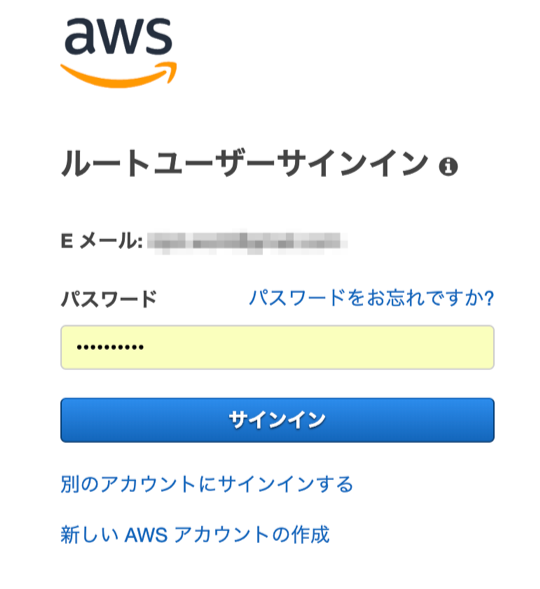
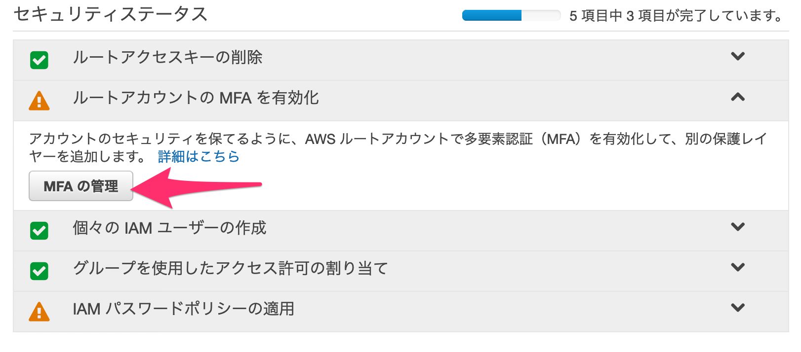
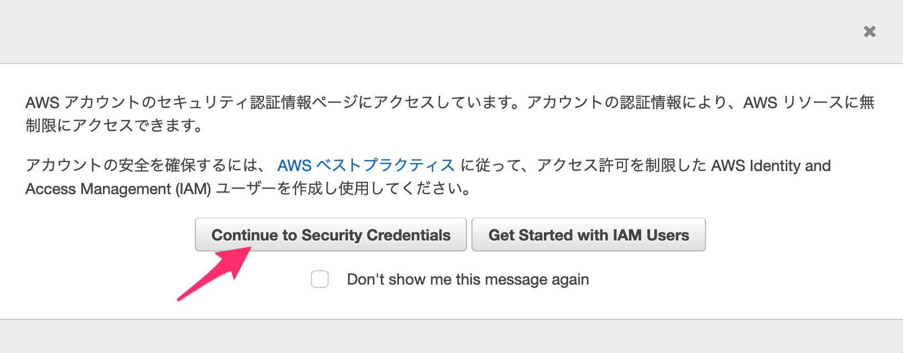
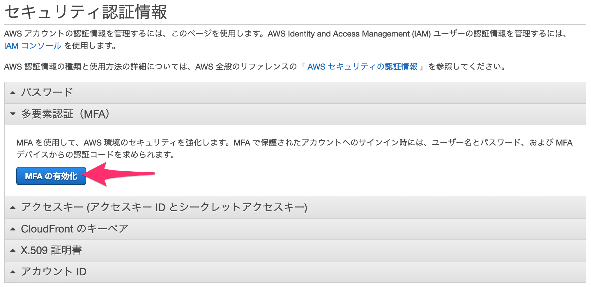
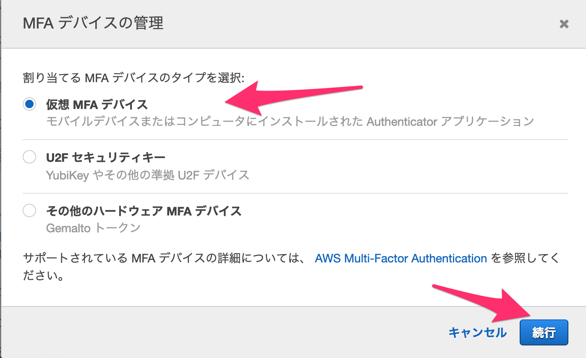
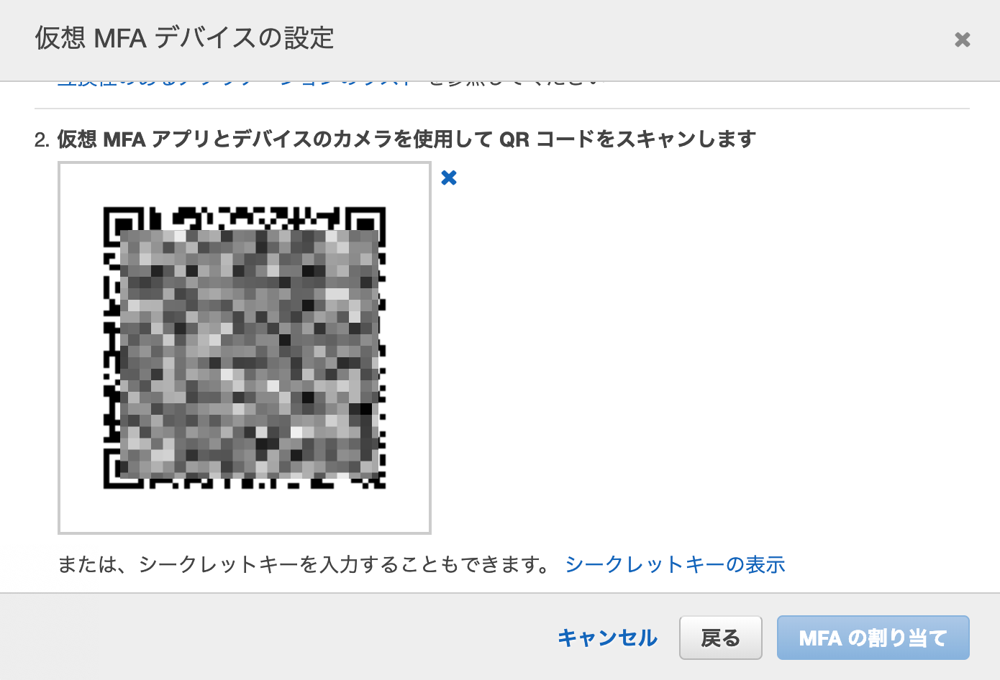
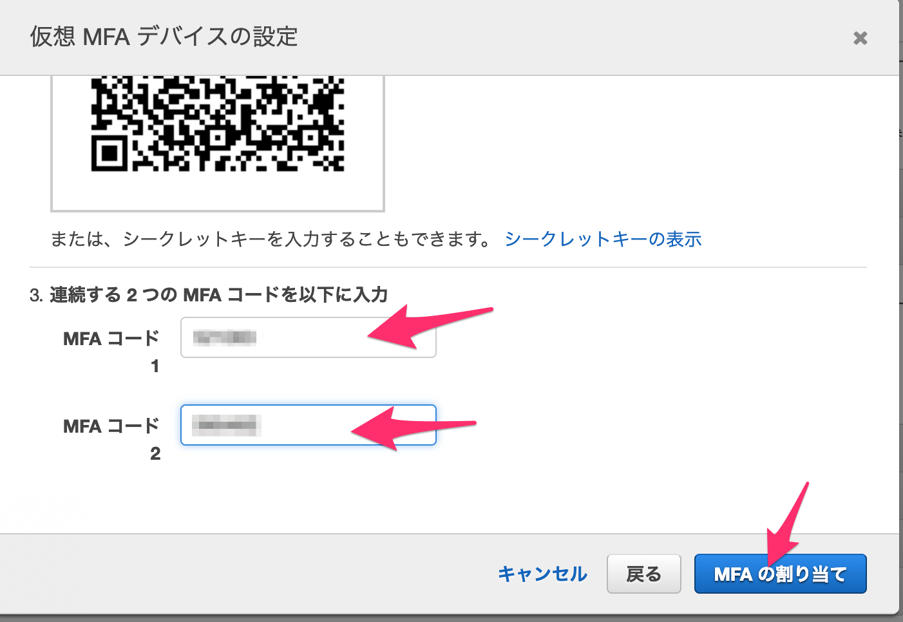
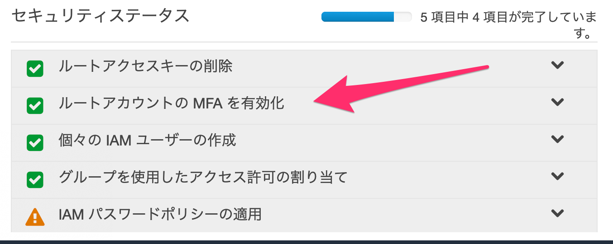
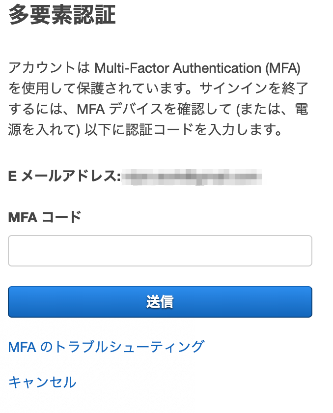

# AWS ルートユーザにMFA を設定する

このハンズオンでは、ルートユーザにMFA を設定する手順を説明します。

## 用語解説
- ルートユーザ
  - AWS アカウントを作成した時に指定したE メールとパスワードを使って認証されるユーザのこと。特徴として、AWS アカウントに対する全ての権限を持ち、またその権限を制限することができなません。そのため、ルートユーザの認証情報が漏れてしまうと非常に危険ですので、MFA でさらに強固に守る必要があります。
- MFA
  - Multi Factor Authentication の略です。日本語では多要素認証と呼びます。MFA を有効化する時には、MFA デバイスを登録します。そうすると、マネージメントコンソールにログインする時に、E メールアドレス・パスワードだけではなくMFA デバイスから出力されたパスコードを入力しないとことができないようにできます。
- MFA デバイス
  - MFA を有効する時に指定するワンタイムパスワードを発行するデバイスです。
  - 仮想MFA デバイスとハードウェアMFA デバイスから選択できます。
  - 仮想MFA デバイスはiOS や Android 端末上で動作するソフトウェア(Google Authenticator / Authy など) を利用できます
  - MFA で利用できるデバイスの詳細は以下のドキュメントに記載されています。
    - [多要素認証](https://aws.amazon.com/jp/iam/details/mfa/)

## AWS のベストプラクティス
セキュリティの観点から、以下のベストプラクティスがあります。
- ルートユーザにはMFA を有効化すること
- ルートユーザを普段の運用に利用せずに代わりにIAM ユーザを作成して運用すること

これはどちらもルートユーザの認証情報が漏洩してしまうと非常に危険であることに基づいています。
このハンズオンでは、１番目の手順を取り上げます。

## 前提条件
- AWS アカウントを作成しており、ルートユーザでマネジメントコンソールにログインできること
- iOS デバイス(iPhoneなど) もしくはAndroid デバイスを持っていること （仮想MFA デバイスとして利用します。）
  - 今回、MFA ソフトウェアとして、Authy を利用します。

## 手順概要
- iOS デバイスにAuthy をインストールする
- マネジメントコンソールにルートユーザでログインする
- MFA を有効化する
- 再度ログインし直してMFA の動作を確認する

## Task1: iOS デバイスにAuthy をインストールする

App Store で "Authy" で検索すると、アプリが検索できますので、これを普通にインストールします。アプリは無償で利用できます。（Android デバイスもほぼ同様のはずです。）

## Task2: マネジメントコンソールにルートユーザでログインする

1. 以下のURL にアクセスし、右上に表示された [コンソールへログイン] ボタンをクリックします。

    https://aws.amazon.com/jp/console/

1. サインイン画面のE メール / パスワードに認証情報を入力して [サインイン] ボタンをクリックします。

    

1. マネジメントコンソールにサインインできたら、画面左上の[サービス] をクリックし、[IAM] をクリックします。(IAM はセキュリティ、アイデンティティ、コンプライアンスのカテゴリにあります。見つからない場合は、検索フィールドに IAM と入力するとすぐに表示されます。)

1. [Identity and Access Management へようこそ] 画面が表示されます。

1. [セキュリティステータス] の [ルートアカウントの MFA を有効化] を展開して、[MFA の管理] ボタンをクリックします。

    

1. [AWS アカウントのセキュリティ認証情報ページに・・・・] という画面が表示されます。[Continue to Security Credentials] ボタンをクリックします。

    

    なお、このページのアカウントの安全を確保するための、[AWS ベストプラクティス](http://docs.aws.amazon.com/console/iam/best-practices) のリンクが載っていますので、必ず目を通しておきましょう。

1. [セキュリティ認証情報] ページの [多要素認証] を展開して、[MFA の有効化] ボタンをクリックします。

    

1. [MFA デバイスの管理] 画面にて、[仮想 MFA デバイス] にチェックが入っていることを確認して、[続行] ボタンをクリックします。

    

1. iOS デバイスで、Authy を起動して、[+Add Account] を押し、次の画面で、[Scan QR Code] をクリックします。

1. [仮想MFA デバイスの設定] 画面にて、[QR コードを表示] をクリックして表示された、QR コードを Authy アプリで読み込ませます。

    

1. [Authy] アプリの画面で、ACCOUNT NAME にわかりやすい名前を入力して、[Done] をクリックします。

1. [MFA デバイスの管理] 画面 の [3. 連続する２つのMFA コードを以下に入力] で、MFA コード１、コード２に、Authy により出力されるコードを２つ分入力します。（連続している必要があります。)その後に、[MFA の割り当て] ボタンをクリックします。

    

1. "仮想 MFA が正常に割り当てられました" と表示されたら、[閉じる] ボタンをクリックします。これでルートユーザに対する MFA 設定は完了です。

1. IAM サービスのダッシュボードの、[セキュリティスタータス] を再度確認してみましょう。以下のように、"ルートアカウントの MFA を有効化" にチェックが入っていることが確認できます。

    

1. 一旦マネージメントコンソールからサインアウトしてください。マネージメントコンソールの右上の、ご自身のアカウントID が表示されている部分をクリックすると、[サインアウト] が表示されますので、それをクリックします。

1. 最初と同じように、マネジメントコンソールにルートユーザでサインインしてください。今度は、以下のような[多要素認証] 画面が表示されます。MFA コードにAuty から出力されたパスコードを入力します。

    

    Note: もしサインインが失敗した場合、パスワードがまちがっているのか、MFA コードがまちがっているのかは判断できません。パスワードが間違っていないかも確認するようにしてください

このハンズオンは以上です。

