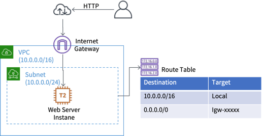

# パブリックサブネットを一つもつVPC を作成する

このハンズオンでは、最もシンプルなパブリックサブネットを一つだけ持つVPC を作成します。その後、VPC 内にEC2 インスタンスを起動しインターネットからアクセスできることを確認します。

## AWS 料金
- 12ヶ月無料利用枠内で実施できます。

## 前提条件
- マネジメントコンソールにログインできること
- VPC および EC2 サービスへのアクセス権限があること
- EC2 に関する知識はある程度あること

## 作成するアーキテクチャ



一つの **VPC** (CIDR: 10.0.0.0/16) を作成し、一つの **サブネット** (CIDR: 10.0.0.0/24) を作成します。
インターネットと通信するために **インターネットゲートウェイ (IGW)** を作成し、**サブネット** に関連づく **ルートテーブル (Route Table)** に **IGW** への経路を定義します。
その後、作成した **Subnet** に　Web Server となる **EC2 インスタンス** を起動し、**セキュリティグループ** によりHTTP 通信で利用する80 番ポートを許可します。Web Server 構築は **ユーザデータ** により実施します。最後にインターネットからアクセスできることを確認します。


## 用語解説
このラボで理解が必要な用語を解説します。もしすでに知っている場合は読み飛ばしてください。

- VPC
  - VPC = **Virtual Private Network** は、AWS 上で仮想的なプライベートネットワークを作成するサービスです。企業では、クラスA 〜　C に定義されているプライベートIP社内に閉じたネットワーク（イントラネット）を構成しますが、VPC はAWS 上でその閉じたネットワークを作成できます。  
  VPC を作成する場合は、**リージョン**　内に作成し、ネットワーク内で利用するIP アドレスの範囲を **CIDR 表記** により指定します。
- サブネット
  - VPC をより細かいIP アドレスの範囲で分割したものを **サブネット** と呼びます。サブネットを作成するときは、どのVPC に作成するのかを選択し、VPC で定義されたIP アドレスをCIDR 表記により分割します。またVPC がリージョンを指定して作成するのに対してサブネットは **アベイラビリティゾーン (AZ)** を指定して作成します。このs部ネットの中にEC2 インスタンスなどのAWS リソースを起動できます。  
  サブネットの設計上の推奨事項としては、インターネットにアクセスできるパブリックサブネットと、インターネットにアクセスできないプライベートサブネットの２つの役割で作成することが推奨されています。要は、サブネットを利用してシステムを論理的に細かく分割することはやめましょうということです。オンプレミスのネットワーク設計ではサブネットがシステムの論理的な区分であるという構成はよく見られますが、この考え方はAWS 上ではアンチパターンです。  
  このラボでは、パブリックサブネットのみを作成します。パブリックサブネットはより正確に説明すると、インターネットゲートウェイへの経路を持ち、インターネットからの受信もインターネットへの送信も可能なサブネットのことをさします。
- CIDR 表記
  - CIDR(Classless Inter-Domain Routing) 表記とは、ネットワークの一般用語で、IP アドレスの範囲を指定する際の表記方法です。具体例としては、`10.0.0.0/16` などのように、IP アドレスの後ろに **スラッシュ /** をつけ、そのあとに**プレフィックス** を表す数字を記述します。  
  IPv4 は32 ビットで構成されているので、`10.0.0.0/16`は先頭の16 ビットは固定で、後ろの16 ビットは可変であることを示しています。つまり、**10.0.0.0 〜　10.0.255.255** までのIP アドレスの範囲を示しています。   
  VPC やサブネットでは、CIDR 表記によりIP アドレスの範囲を指定します。またセキュリティグループなど、通信先や元のIP アドレスの範囲を指定する場合にもCIDR 表記を利用します。  
  特殊な表記としては、`0.0.0.0/0` がありこれはIP アドレス全体を示す表記になります。
- インターネットゲートウェイ (IGW)
  - VPC は閉じたネットワークなので、VPC 内部とインターネットなどのVPC の外のネットワークとは直接通信できません。インターネットゲートウェイ(IGW) はVPC とインターネットを通信できるようにするゲートウェイです。
- ルートテーブル
  - ルートテーブルは、VPC 内部のネットワークの経路を定義するテーブルです。サブネットに関連づけることでそのサブネット内で発生した通信の経路を制御できます。  
  このラボでは、インターネットゲートウェイへの経路を持つサブネットを作成します。
- セキュリティグループ
  - セキュリティグループとは、EC2 インスタンスを守る仮想ファイアウォールです。セキュリティグループは、何もしてしないと、全ての通信を拒否します。よって明示的に通したいポートを許可する設定が必要になります。  
  設定内容は、許可したいポート番号と、どこから送信されたのかを示す**ソース** を指定します。 
  EC2 インスタンスを作成する際は必ず一つ以上のセキュリティグループに関連づける必要があります。 　
  このラボではhttp通信で利用する80番ポートに対して、全てのIP アドレス(0.0.0.0/0) からの通信を許可する設定をします。
- ユーザデータ
  - EC2 インスタンスを起動する際に、自動実行されるスクリプトを定義しておくことができるEC2 のパラメータです。ユーザデータに指定したスクリプトは、EC2 インスタンスが最初に起動する際に一度だけ実行されます。   
  この仕組みを利用すると、例えば、Apache(httpd) をインストールして、アプリケーションを構成するような処理を起動時に自動的に実行させることができます。  
  このラボでは、httpd をインストール・起動して、簡単なトップページ（index.html) を構成する処理をユーザデータで自動実行させます。

## 手順概要
- Task1: 東京リージョンにVPC を作成し、サブネットを作成する
- Task2: インターネットゲートウェイを作成し、VPC にアタッチする
- Task3: ルートテーブルを作成し、インターネットゲートウェイへの経路を追加し、サブネットにアタッチする
- Task4: EC2 インスタンスを作成したサブネット内に起動する
  - ユーザデータによりWeb Server を自動構成
  - セキュリティグループにより80 番ポートを許可
- Task5: ブラウザからEC2 インスタンスにアクセスしてみる


## ラボ実施時の注意点
AWS マネジメントコンソールは頻繁に更新されるため、ラボ手順と画面の内容が異なる可能性があります。ボタン名など英語表記になっていたりもします。その場合は、適宜手順を読み替えてください。現在の手順が何の目的で実施しているのかを絶えず意識すると多少画面に変化があっても対応できます。


##  Task1: 東京リージョンにVPC を作成し、サブネットを作成する

1. **マネジメントコンソール** にログインする
     - https://console.aws.amazon.com
  
2.  画面右上で、リージョンが、**東京** になっていることを確認する。異なるリージョンであれば、**東京** を選択する(なお東京以外のリージョンでも実施可能です。) 
3. 画面左上の**サービス** から **VPC** を選択する
4. 画面左側のナビゲーションペインにて、**VPC** を選択する
5.  **Create VPC** ボタンをクリックする(VPC ダッシュボード画面上の**Create VPC** ボタンではありませんのでご注意ください)
6. **VPC 作成** 画面にて、以下の内容を入力します。これ以外はデフォルトのままとしておきます。
   - 名前タグ: `LabVPC`
   - IPv4 CIDR blocブロック: `10.0.0.0/16`

7. **作成** ボタンをクリックします。
8. **VPC が作成されました** 画面で **閉じる** ボタンをクリックします。VPC の作成は以上です。
9. 左側のナビゲーションペインにて、**サブネット** をクリックします。
10. **サブネットの作成** ボタンをクリックします。
11. **サブネットの作成** 画面にて、以下の内容を入力します。
    - 名前タグ: `PublicSubnet`
    - VPC: `LabVPC` を選択
    - アベイラビリティゾーン: `ap-northeast-1a` (東京リージョン以外の場合は先頭のAZ を選択)
    - IPv4 CIDR ブロック: `10.0.0.0/24

12. **作成** ボタンをクリックします。
13. **次のサブネットが作成されました** 画面で **閉じる** ボタンをクリックします。

以上、VPC と サブネットの作成が完了しました。


##  Task2: インターネットゲートウェイを作成し、VPC にアタッチする

1. ナビゲーションペインにて、**インターネットゲートウェイ** をクリックします。
   
2. **インターネットゲートウェイの作成** ボタンをクリックします。
3. **インターネットゲートウェイの作成** 画面にて、**Name タグ** に `LabIGW` と入力します。
4. **作成** ボタンをクリックします。
5. **次のインターネットゲートウェイが作成されました** 画面で **閉じる** ボタンをクリックします。
6. 一覧に **LabIGW** が存在していることを確認します。もし存在していない場合は、一覧右上の更新(円形の２本の矢印)ボタンをクリックしててください。
7. 次に、作成したIGW を **LabVPC** にアタッチします。一覧上で、**LabIGW** のチェックボックスにチェックを入れます。
8. **アクション** をクリックして **VPC にアタッチ** を選択します。
9.  **VPC** で `LabVPC` を選択し、**アタッチ** ボタンをクリックします。

    Task2　は以上です。


##  Task3: ルートテーブルを作成し、インターネットゲートウェイへの経路を追加し、サブネットにアタッチする

1. ナビゲーションペインにて、**ルートテーブル** をクリックします。

2. **ルートテーブルの作成** ボタンをクリックします。
3. **ルートテーブルの作成** 画面にて、以下の内容を入力します。
   - 名前タグ: `PublicRT`
   - VPC: `LabVPC` を選択
4. **作成** ボタンをクリックします。
5. **次のルートテーブルが作成されました** 画面で **閉じる** ボタンをクリックします。
6. 一覧に `PublicRT` が表示されていることを確認します。
7. 一覧で `PublicRT` のチェックボックスにチェックを入れて **アクション** から **ルートの編集** をクリックします。
8. **ルートの編集** 画面にて、**ルートの追加** ボタンをクリックします。
9. 以下の内容を入力します。
    - 宛先(Destination): `0.0.0.0/0`
    - ターゲット: `Internet Gateway` をクリックして、`LabIGW` を選択

10. **ルートの保存** ボタンをクリックします。
11. **ルートの編集が成功しました** 画面で **閉じる**　ボタンをクリックします。
12. 一覧で、**PublicRT** にチェックが入った状態で再度 **アクション** をクリックし、**サブネットの関連を編集** をクリックします。
13. **サブネットの関連を編集** 画面で、`PublicSubnet` にチェックを入れて **保存**　ボタンをクリックします。

    Task3 は以上です。


##  Task4: EC2 インスタンスを作成したサブネット内に起動する

ここまでで、必要なVPC の構成は完了しました。次に先ほど作成した`PublicSubnet` にEC2 インスタンスを起動します。

1. マネジメントコンソールの **サービス** から **EC2** を選択します。
   
2. 画面左のナビゲーションペインにて **インスタンス** をクリックします。
3. **インスタンスの作成** ボタンをクリックします。
4. **手順 1: Amazon マシンイメージ (AMI)** 画面にて、一番上に表示されている **Amazon Linux 2 AMI (HVM), SSD Volume Type** の横の **選択** ボタンをクリックします。(必ず一番上の Amazon Linux **2** を選択してください。)
5. **手順 2: インスタンスタイプの選択** 画面ではデフォルトの **t2.micro** が選択されたままで、**次の手順: インスタンスの詳細の設定** をクリックします。
6. **手順 3: インスタンスの詳細の設定** 画面にて、以下の内容を入力します。記載がないものはデフォルトのままとしておきます。
   - ネットワーク: `LabVPC`
   - サブネット: `PublicSubnet` (自動選択される)
   - 自動割り当てパブリック IP: `有効` 
7. 画面を下にスクロールして、**高度な詳細** 部分を展開します。
8. **ユーザデータ** のテキストエリアに以下のシェルスクリプトをコピー＆ペースとします。このスクリプトでは、Apache (httpd) をインストールして、起動状態にし、あらかじめ用意された index.html をトップページに指定しています。

    ```
    #!/bin/bash
    yum -y install httpd
    systemctl enable httpd.service
    systemctl start httpd.service
    wget https://raw.githubusercontent.com/tomofuminijo/aws-handson-labs/master/SinglePublicVPC/index.html -O /var/www/html/index.html
    ```

9.  **次の手順: ストレージの追加** をクリックします。
10. **手順 4: ストレージの追加** 画面では何も変更せずに、**次の手順: タグの追加** をクリックします。
11. **手順 5: タグの追加** 画面で **タグの追加** ボタンをクリックし、以下を入力します。
    - キー: `Name` (大文字小文字を区別)
    - 値: `LabWebServer`
12. **次の手順: セキュイティグループの設定** ボタンをクリックします。
13. **手順 6: セキュリティグループの設定** 画面にて、以下の内容を入力します。

    |||
    |---|---|
    |セキュリティグループの割り当て|**新しいセキュリティグループを作成する** にチェック（デフォルトのまま)|
    |セキュリティグループ名|`LabWebSG`|
    |説明|`Web Server Security Group`| 

14. 下の一覧の既存の `SSH` 列は今回利用しないため、列右側の **×**　ボタンをクリックして削除します。
15. **ルールの追加** ボタンをクリックして、以下の内容を入力します。
    
    |||
    |---|---|
    |タイプ|`HTTP`|
    |ソース|`任意の場所`|

    **任意の場所** を指定することで、'0.0.0.0/0' というCIDR　が自動的に設定されます。この設定はインターネット全体から 80 番ポートにアクセスを許可するという設定になります。  

    また、画面下側に22番ポートが開いていないという警告が出ますが、今回はSSH アクセスしないため無視して構いません。

16. **確認と作成** ボタンをクリックします。
17. **手順 7: インスタンス作成の確認** 画面で、**起動** ボタンをクリックします。
18. **既存のキーペアを選択するか、新しいキーペアを作成します。**　画面にて **キーペアの選択** を **キーペアなしで続行** に変更し、**このAMI に組み込まれたパスワードが…（略)…** にチェクを入れて、**インスタンスの作成** ボタンをクリックします。
19. **作成ステータス** 画面にて、**インスタンスの表示** ボタンをクリックします。
20. 一覧中に **LabWebServer** が表示されていることを確認します。


##  Task5: ブラウザからEC2 インスタンスにアクセスしてみる

1. 起動するまで２分ほど時間がかかります。一覧の **LabWebServer** の **ステータス** が　**running** になったことを確認します。

2. 一覧で **LabWebServer** にチェックを入れて、一覧下に表示される **パブリックIP** をコピーします。
3. ブラウザで別のタブを開いて、アドレスバーにコピーしたIP アドレスを貼り付けてキーボードのEnter を押します。
4. **Welcom to AWS!!** 画面が表示されたら正常に動作しています。

## 終了処理

１２ヶ月間無料利用枠の中には、今回起動した **t2.micro** インスタンスの月当たり 750 時間分の無料利用枠があります。１ヶ月無償で利用できる時間ですが、複数のインスタンスを起動している場合などに課金される場合がありますので、不要であれば削除してください。   
なお、VPC は課金されませんので残しておいて問題ありません。

1. **LabWebServer** にチェックを入れた状態で、**アクション** をクリックし、**インスタンスの状態** > **終了** をクリックします。

2. **インスタンスの削除** 画面で、**はい、削除する** をクリックします。
3. **インスタンスの状態** が **shutting-down** になり、しばらく(1-2分)すると **terminated** に変わります。
4. **terminated**　状態になったら課金されません。**terminated** 状態のインスタンスはしばらく一覧上に残りますが、数時間後に消えますので放置しておきましょう。

このハンズオンは以上です。
